---
# Front matter
lang: ru-RU
title: " Поиск файлов. Перенаправление ввода-вывода. Просмотр запущенных процессов"
subtitle: "ЛР по ОС №7"
author: "Аникин Константин Сергеевич"
group: НПИбд-01-20

# Formatting
toc-title: "Содержание"
toc: true # Table of contents
toc_depth: 2
lof: true # List of figures
lot: true # List of tables
fontsize: 12pt
linestretch: 1.5
papersize: a4paper
documentclass: scrreprt
polyglossia-lang: russian
polyglossia-otherlangs: english
mainfont: PT Serif
romanfont: PT Serif
sansfont: PT Sans
monofont: PT Mono
mainfontoptions: Ligatures=TeX
romanfontoptions: Ligatures=TeX
sansfontoptions: Ligatures=TeX,Scale=MatchLowercase
monofontoptions: Scale=MatchLowercase
indent: true
pdf-engine: lualatex
header-includes:
  - \linepenalty=10 # the penalty added to the badness of each line within a paragraph (no associated penalty node) Increasing the value makes tex try to have fewer lines in the paragraph.
  - \interlinepenalty=0 # value of the penalty (node) added after each line of a paragraph.
  - \hyphenpenalty=50 # the penalty for line breaking at an automatically inserted hyphen
  - \exhyphenpenalty=50 # the penalty for line breaking at an explicit hyphen
  - \binoppenalty=700 # the penalty for breaking a line at a binary operator
  - \relpenalty=500 # the penalty for breaking a line at a relation
  - \clubpenalty=150 # extra penalty for breaking after first line of a paragraph
  - \widowpenalty=150 # extra penalty for breaking before last line of a paragraph
  - \displaywidowpenalty=50 # extra penalty for breaking before last line before a display math
  - \brokenpenalty=100 # extra penalty for page breaking after a hyphenated line
  - \predisplaypenalty=10000 # penalty for breaking before a display
  - \postdisplaypenalty=0 # penalty for breaking after a display
  - \floatingpenalty = 20000 # penalty for splitting an insertion (can only be split footnote in standard LaTeX)
  - \raggedbottom # or \flushbottom
  - \usepackage{float} # keep figures where there are in the text
  - \floatplacement{figure}{H} # keep figures where there are in the text
---

# Цель работы

- Ознакомление с инструментами поиска файлов и фильтрации текстовых данных. 

- Приобретение практических навыков: по управлению процессами (и заданиями), по проверке использования диска и обслуживанию файловых систем.

# Задание

- Ознакомиться с теоретическим материалом

- Выполнить задание лабораторной

# Выполнение лабораторной работы

1. Я не понял, что подразумевается этим пунктом. Просто войти в систему под своим именем? Я это и так каждый раз делаю.

2. Запись названий файлов папки etc и домашнего каталога (рис. -@fig:021)

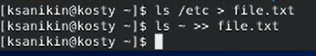{ #fig:021 }

... и вывод результатов работы (рис. -@fig:022)

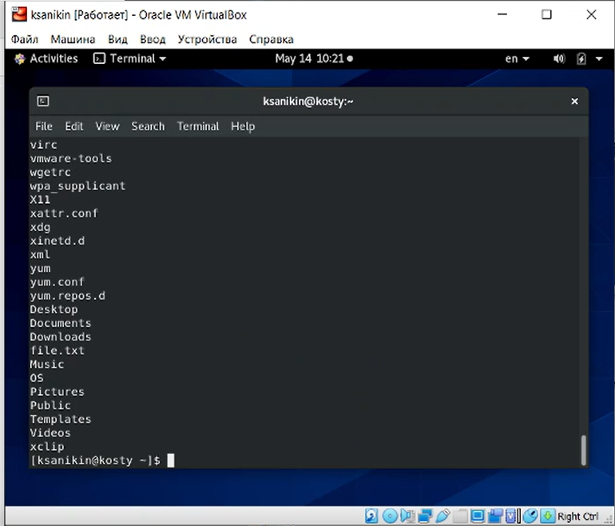{ #fig:022 }

3. Запись названий всех .conf файлов в conf.txt

Во время работы я ошибся. Надо было указать "\*.conf" вместо ".conf", в файл попали лишние названия (рис. -@fig:031)

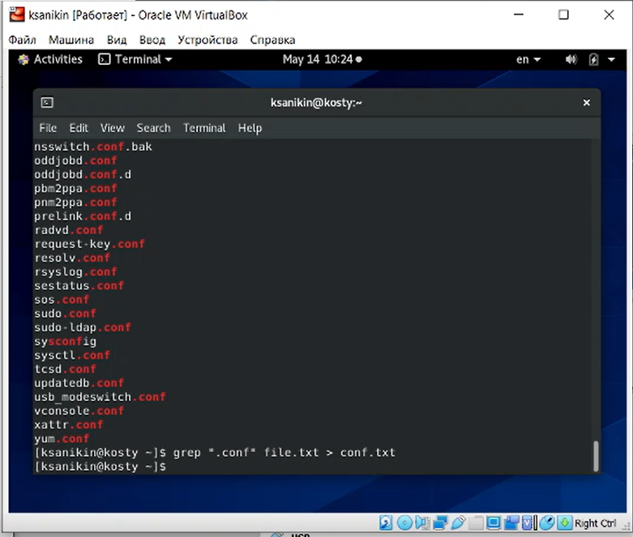{ #fig:031 }

4. Команда для вывода всех файлов домашнего каталога, начинающихся на c. 

Второй вариант - записать все названия в файл, после чего вывести их cat-ом или подобным. (рис. -@fig:041)

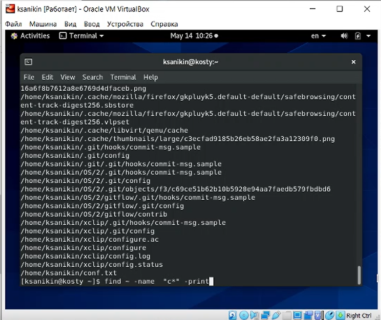{ #fig:041 }

5. Программа для вывода всех файлов из etc, начинающихся на h, на экран. (рис. -@fig:051)

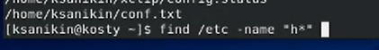{ #fig:051 }

И результаты работы программы  (рис. -@fig:052)

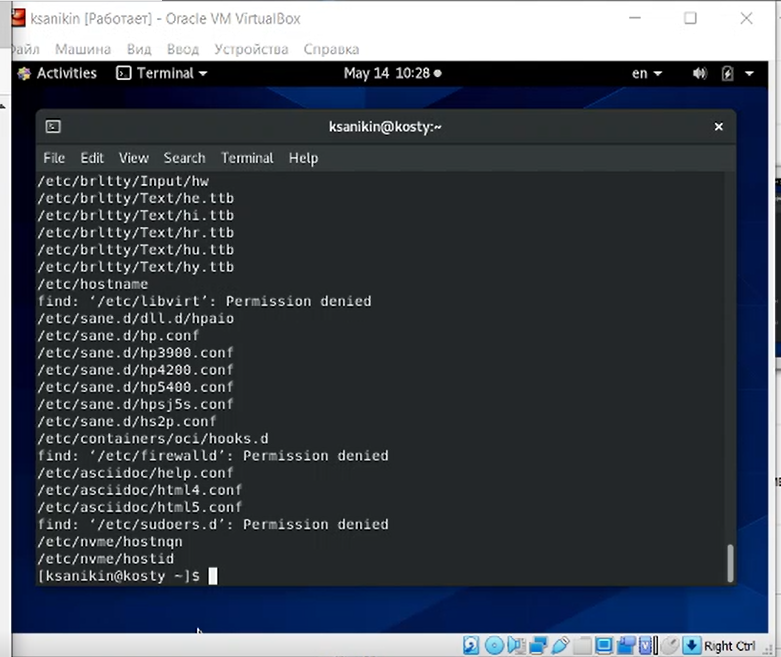{ #fig:052 }

Как вывести это постранично, я так и не разобрался.

6. Программа для запуска в фоновом режиме записи log файлов в logfile (рис. -@fig:061)

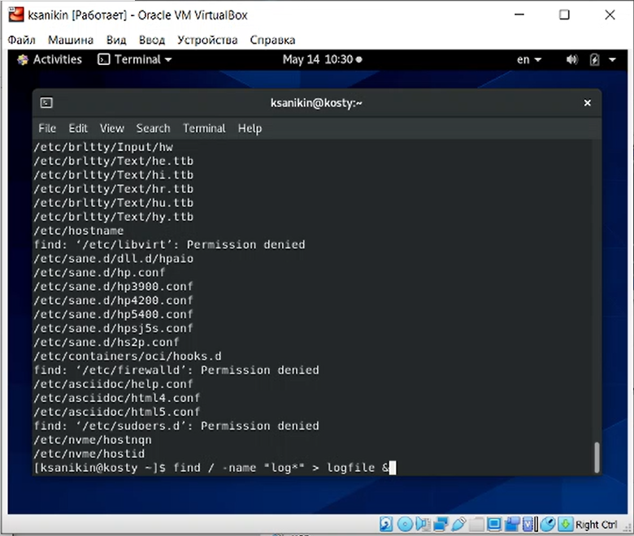{ #fig:061 }

7. Удаление logfile (рис. -@fig:071)

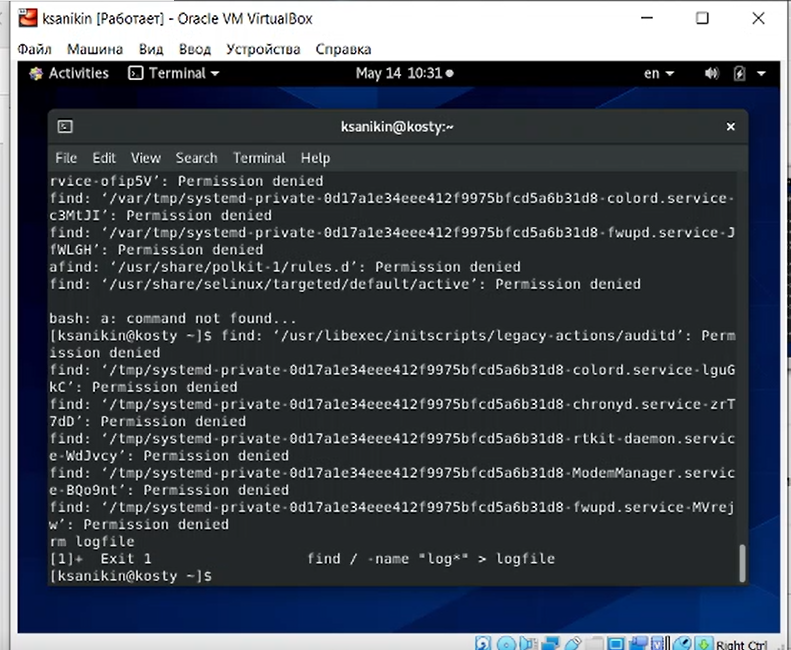{ #fig:071 }

8-9. Запуск gedita фоном, узнавание идентификатора процесса ps-ом

Узнать идентификатор можно проще, либо командой jobs, 

либо посмотрев на номер работы при создании процесса (рис. -@fig:08191)

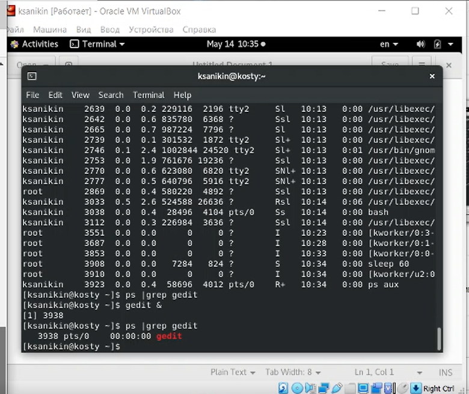{ #fig:08191 }

10. Убийство gedita (рис. -@fig:101)

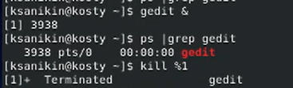{ #fig:101 }

11. Выведенный man по df (рис. -@fig:111)

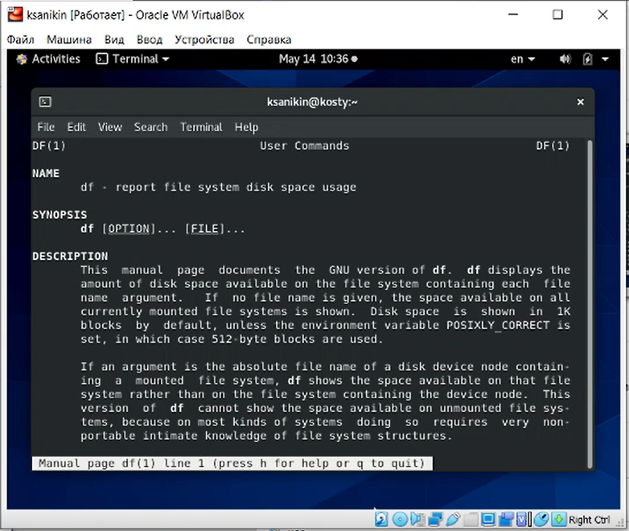{ #fig:111 }

Результат работы команды df (рис. -@fig:112)

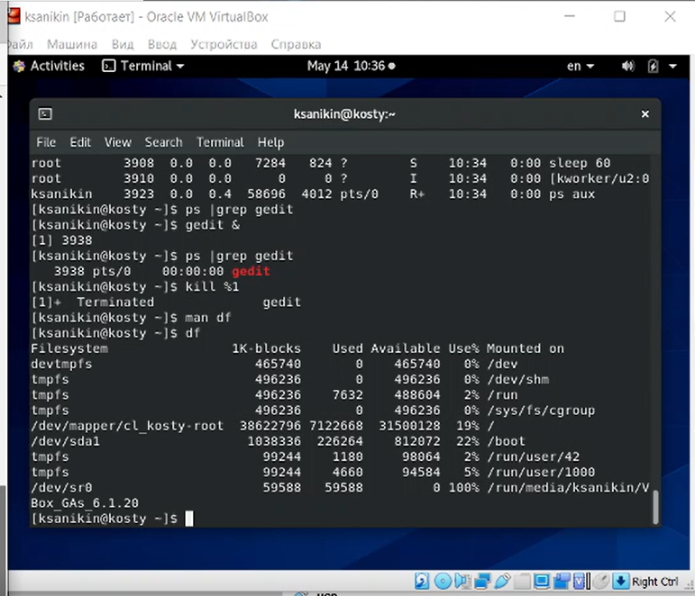{ #fig:112 }

Выведенный man по du (рис. -@fig:113)

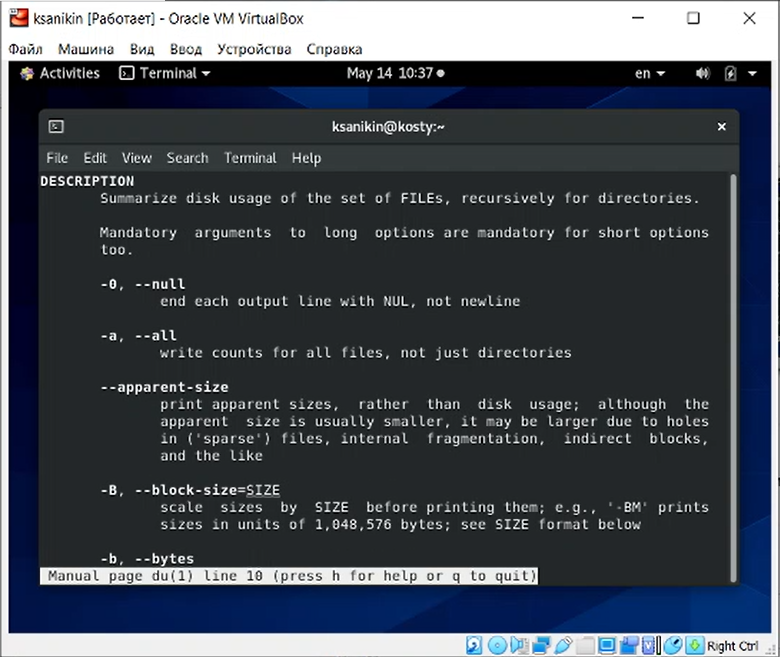{ #fig:113 }

Результат работы команды du (рис. -@fig:114)

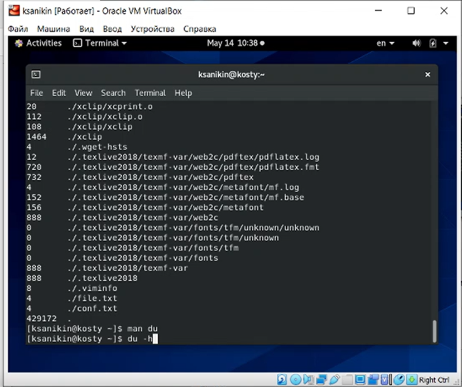{ #fig:114 }

12. Команда для вывода всех подпапок домшнего каталога (рис. -@fig:121)

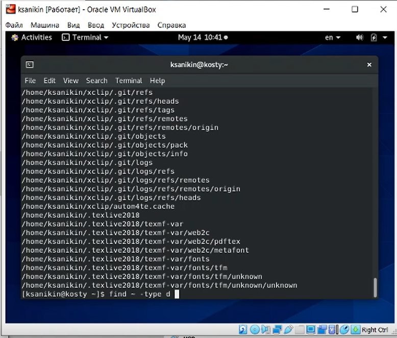{ #fig:121 }

Также я нашёл способ вывести только подпапки текущего каталога, но без команды find (рис. -@fig:122)

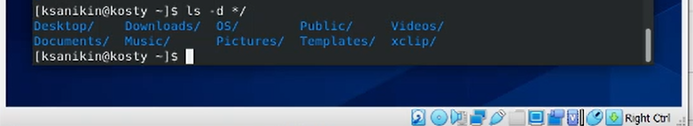{ #fig:122 }

# Выводы

По ходу работы возникли недопонимания, и сказать, что всё выполнено правильно, я не могу, однако большая часть должна быть сделана верно.