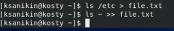
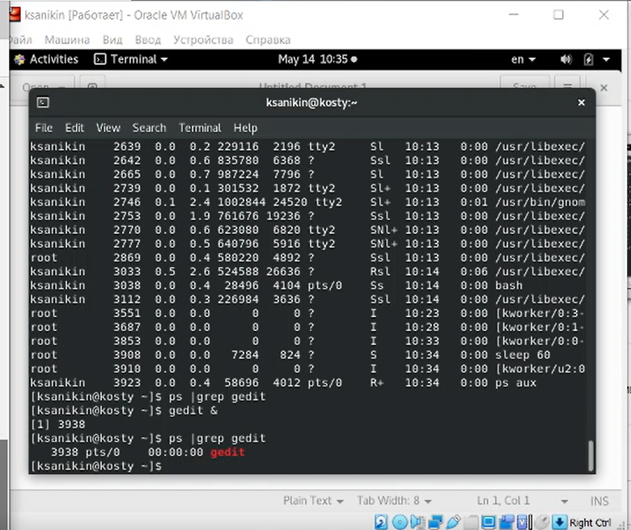
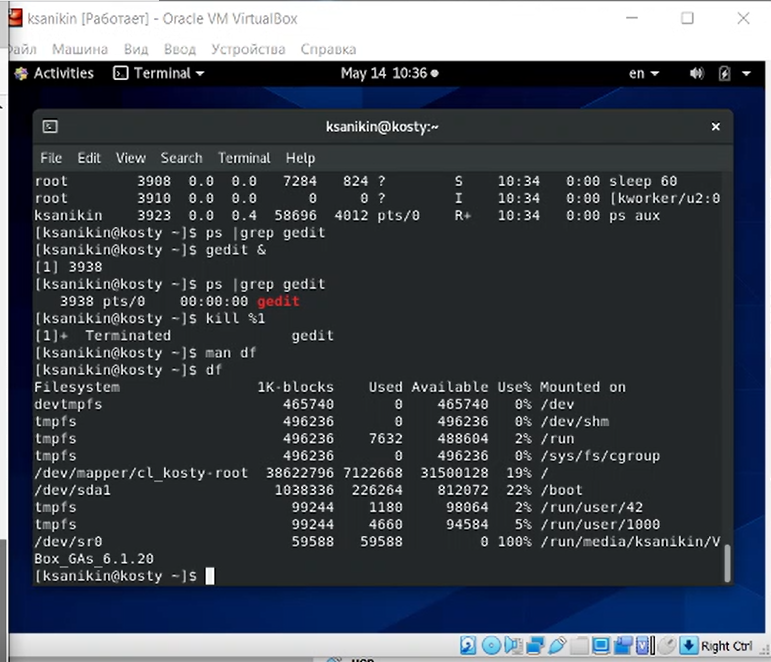
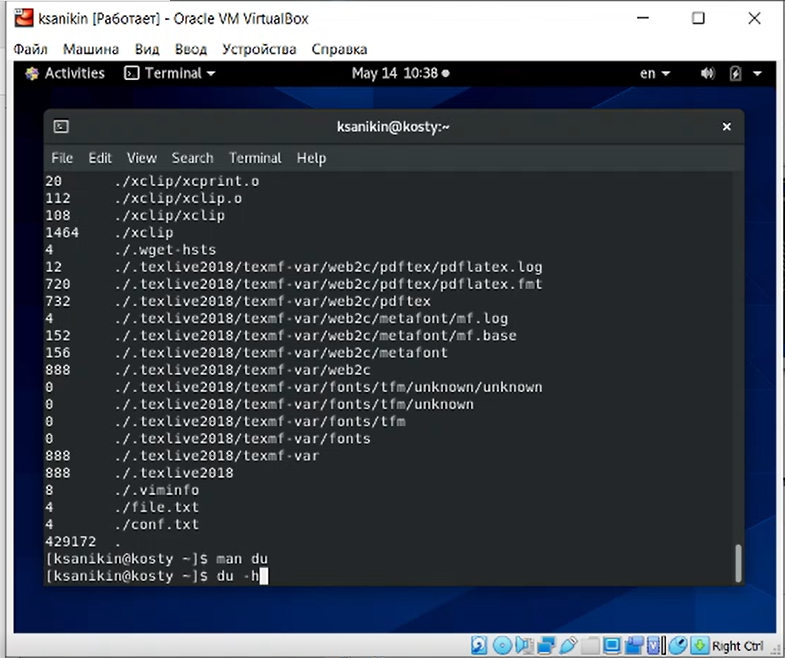

---
## Front matter
lang: ru-RU
title: Отчёт по ЛР№7 по ОС 
author: Аникин Константин Сергеевич
group: НПИбд-01-20

## Formatting
toc: false
slide_level: 2
theme: metropolis
header-includes: 
 - \metroset{progressbar=frametitle,sectionpage=progressbar,numbering=fraction}
 - '\makeatletter'
 - '\beamer@ignorenonframefalse'
 - '\makeatother'
aspectratio: 43
section-titles: true
---

# Цели

- Ознакомление с инструментами поиска файлов и фильтрации текстовых данных. 

- Приобретение навыков по управлению процессами (и заданиями) 

- Приобретение навыков по проверке использования диска и обслуживанию файловых систем.

---

# Задачи

- Ознакомиться с теоретическим материалом

- Выполнить задание лабораторной

---

# Результаты 1

## Поиск файлов

## Передача результата одной программы в другую

---

# Результаты 2

## Использование конвейера

## Работа с процессами 

---

# Результаты 3

## Проверка использования диска

---

# Итоги

- Работа выполнена полностью

- Есть моменты, оставшиеся неясными: постраничное выведение, использование regexpов

- Предложен вывод директорий без использования find